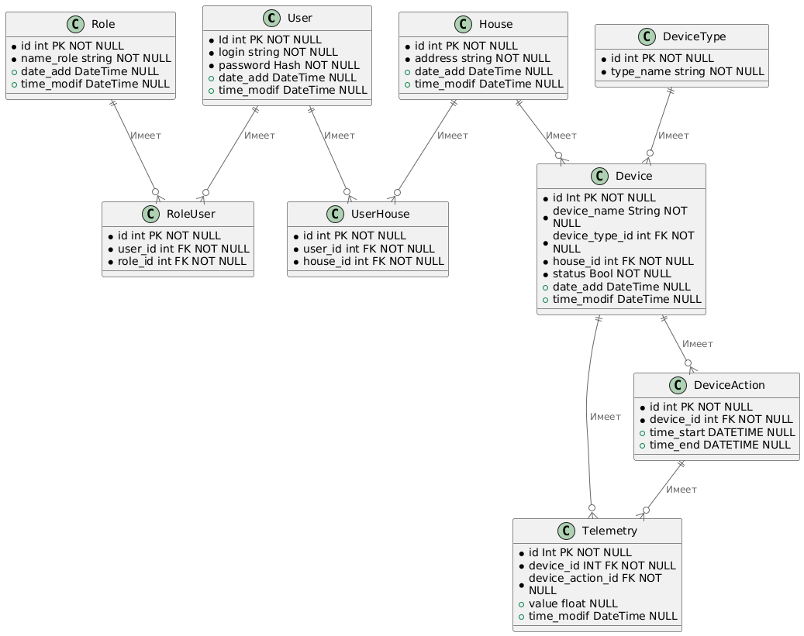

## Задание 1
1) Управление отоплением
    - Включение/отключение отопления
    - Регулирование температуры
   Проверка температуры
    - Получение информации о температуре

    Все управление происходит от сервера к датчику.

2) 
  - Домен: управление отоплением
    - Поддомен: управление температурой
      - Контекст: установка температуры
      - Контекст: включение/выключение отопления
  - Домен: Мониторинг температуры
    - Поддомен: просмотр температуры
      - Контекст: получение информации о температуре

3) Проблемы приложения:
  - Тяжело масштабировать систему, т.к. архитектура этого ПО является монолитным
  - Для деплоя необходимо останавливать все приложение
  - Все взаимодействия происходят синхронно, может привести к снижение производительности и задержкам при обработке запросов

- Язык программирования: Java
- База данных: PostgreSQL

Диаграмма: 

## Задание 2

1) Микросервисы:
    - Управление устройствами - микросервис завязан на включение/отключение отопления, регулирование температуры, выбора камер в доме, автоматического открытия/закрытия ворот
    - Управление телеметрией - микросервис для сбора информации с телеметрии
    - Управление пользователями - микросервис для добавлния/редактирования/удаления пользователей и аутентификации
    - Сервис автоматизации - для настройки сценария устройств
    - Управление уведомлениями - микросервис для отпавки уведомлению пользователю о том, что действие совершено успешно или безуспешно

2) Взаимодействие:
  - Взаимодействия пользователя происходит через API Gateway
  - Шина данных Kafka, взамодействие с датчиком
  - У каждого микросервиса своя БД

3)
  - Диаграмма контейнеров
    
  

  - Диаграмма компонентов
    
  

  - Диаграмма кода
    
  

## Задание 3
ER-Диаграмма

- Пользователь — Дом: один пользователь может иметь доступ к нескольким домам, но каждый дом связан только с одним пользователем.
- Пользователь - Роль: один пользователь может иметь несколько ролей
- Дом — Устройство: один дом может содержать несколько устройств, и каждое устройство принадлежит только одному дому. 
- Тип устройства - Устройство: одно устройство может иметь один тип
- Устройство — Телеметрия: одно устройство может генерировать множество записей телеметрии.

## Часть 2. Задание 1

[Документация OpenAPI](api/openapi.yaml)
