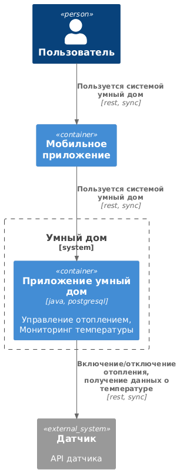
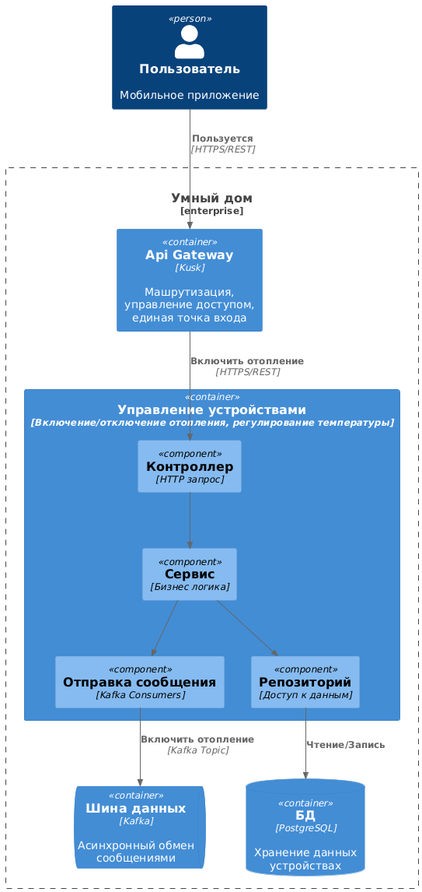

## Задание 1
1) Управление отоплением
    - Включение/отключение отопления
    - Регулирование температуры
   Проверка температуры
    - Получение информации о температуре

    Все управление происходит от сервера к датчику.

2) 
  Домен: управление отоплением
    - Поддомен: управление температурой
      - Контекст: установка температуры
      - Контекст: включение/выключение отопления
  Домен: Мониторинг температуры
    - Поддомен: просмотр температуры
      - Контекст: получение информации о температуре

3) Проблемы приложения:
  - Тяжело масштабировать систему, т.к. архитектура этого ПО является монолитным
  - Для деплоя необходимо останавливать все приложение
  - Все взаимодействия происходят синхронно, может привести к снижение производительности и задержкам при обработке запросов

Диаграмма: 

## Задание 2

1) Микросервисы:
    - Управление устройствами - микросервис завязан на включение/отключение отопления, регулирование температуры
    - Управление наблюдением - микросервис для выбора камер в доме
    - Управление воротами - микросервис для автоматического открытия/закрытия ворот
    - Мониторинг температуры - микросервис для просмотра текущей температуры в доме
    - Управление пользователями - микросервис для добавлния/редактирования/удаления пользователей
    - Управление уведомлениями - микросервис для отпавки уведомлению пользователю о том, что действие совершено успешно или безуспешно

2) Взаимодействие:
  - Взаимодействия пользователя происходит через API Gateway
  - Шина данных Kafka, взамодействие с датчиком
  - У каждого микросервиса своя БД

3)
  - Диаграмма контейнеров
    
  

  - Диаграмма компонентов
    
  

  - Диаграмма кода
    
  

## Задание 3
ER-Диаграмма

